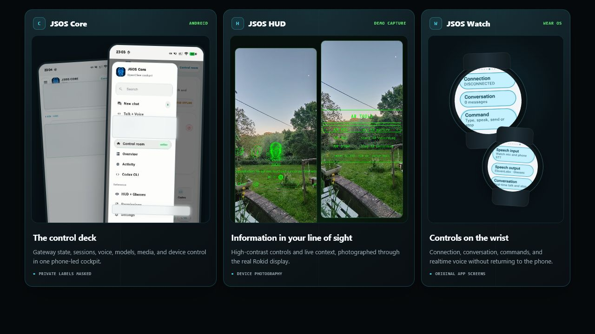
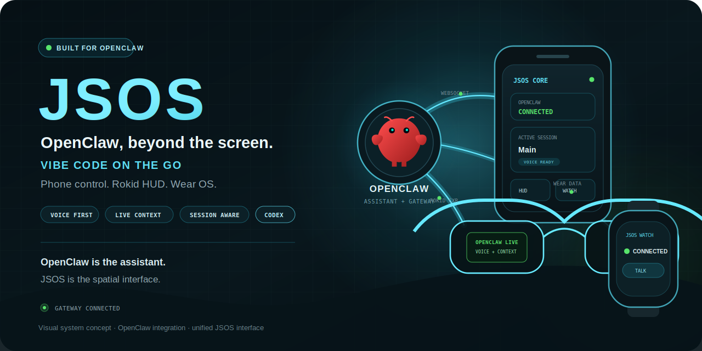
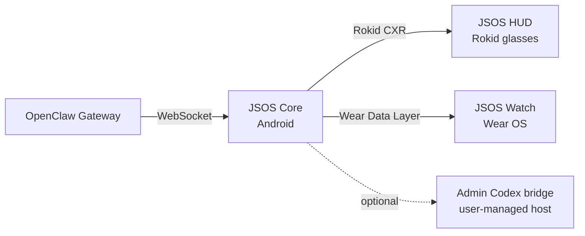

<p align="center">
  
</p>

<h1 align="center">JSOS</h1>

<p align="center">
  <strong>A voice-first spatial cockpit for OpenClaw on Android, Rokid glasses, and Wear OS.</strong>
</p>

<p align="center">
  <a href="https://github.com/IWhatsskill/JSOS/releases/tag/v2.0.33-watch-ui"><strong>Download preview</strong></a>
  &nbsp;&nbsp;·&nbsp;&nbsp;
  <a href="docs/videos/JSOS-showcase.mp4"><strong>Watch the demo</strong></a>
  &nbsp;&nbsp;·&nbsp;&nbsp;
  <a href="docs/INSTALL.md"><strong>Setup guide</strong></a>
</p>

<p align="center">
  
  
  
  
</p>

> [!IMPORTANT]
> JSOS is a development preview for builders and testers. It is not a finished consumer product.

JSOS turns a phone, Rokid glasses, and an optional Wear OS watch into one
session-aware interface for OpenClaw. Core owns the connection and credentials;
the HUD keeps information glanceable; the watch keeps essential controls within
reach.

## One system. Three surfaces.

<p align="center">
  
</p>

<p align="center"><sub>Original JSOS interface captures. Private Core labels are masked; the HUD panels are demo device photography.</sub></p>

## Built for OpenClaw

OpenClaw remains the assistant and control plane: gateway, sessions, voice, and
live context. JSOS turns that foundation into a coordinated phone, glasses, and
wrist experience.

<p align="center">
  
</p>

<p align="center"><sub>Official OpenClaw mascot from <a href="https://github.com/openclaw/openclaw">openclaw/openclaw</a>; JSOS system composition.</sub></p>

## Built for movement, not another mirrored chat window

- **Glanceable by design** — live state and assistant output stay readable without
  turning the glasses into a dense phone screen.
- **Voice first** — speech input, realtime voice, and optional TTS work across the
  phone-led flow.
- **Session aware** — switch OpenClaw sessions and models without losing the
  current context.
- **Local by default** — runtime credentials remain on the user's devices and
  managed hosts.
- **Three coordinated surfaces** — Core remains the source of truth while HUD and
  Watch expose the controls that matter in the moment.

## Real-device HUD

<p align="center">
  
</p>

The Rokid HUD uses a deliberately restrained monochrome presentation for
visibility in the optical display. Phone and Watch use cyan for structure;
green remains reserved for active, ready, paired, and online states.

## Quick start

1. Download JSOS Core, JSOS HUD, and the optional JSOS Watch APK from the
   [current preview release](https://github.com/IWhatsskill/JSOS/releases/tag/v2.0.33-watch-ui).
2. Install JSOS Core on the Android phone and configure the OpenClaw Gateway.
3. Pair the Rokid glasses through Hi Rokid.
4. Deploy and launch JSOS HUD on the glasses.
5. Optionally install JSOS Watch on a paired Wear OS device.

For requirements, signing notes, and the complete connection flow, see
[docs/INSTALL.md](docs/INSTALL.md).

## Architecture



JSOS Core owns credentials, sessions, models, and runtime state. HUD and Watch
receive only the state and actions required for their companion role.

## Documentation

| Guide | Purpose |
| --- | --- |
| [Install](docs/INSTALL.md) | Requirements, configuration, build, and connect flow |
| [Architecture](docs/ARCHITECTURE.md) | Components, protocols, and ownership |
| [HUD](docs/HUD.md) | Display model, controls, voice, camera, and R08 input |
| [Screenshots](docs/SCREENSHOTS.md) | Public-safe visual gallery |
| [Security](docs/SECURITY.md) | Credentials, signing, logs, and release safety |
| [Troubleshooting](docs/TROUBLESHOOTING.md) | Pairing, connection, install, voice, and TTS |

## Build from source

Requirements: JDK 17, Android SDK, Android Studio or Gradle, Rokid CXR SDK
access, and a reachable OpenClaw Gateway.

```bash
./gradlew :phone-app:assembleDebug :glasses-app:assembleDebug :watch-app:assembleDebug
```

Release signing remains local-only. Never commit keystores, signing properties,
runtime credentials, private screenshots, transcripts, or generated APKs.

## Preview status

Rokid behavior depends on device firmware, the proprietary Rokid CXR SDK, and
Hi Rokid availability. Validate voice, watch, HUD, and optional bridge flows
against the exact devices and gateway version you plan to use.

## Attribution and license

JSOS is based on the upstream
[Clawsses](https://github.com/dweddepohl/clawsses) Android glasses project.
Original upstream copyright remains with Pohlster BV and the original
contributors. JSOS modifications are by Whatsskill, 2026.

This project is distributed under the
[GNU Affero General Public License v3](LICENSE). See [COPYRIGHT](COPYRIGHT) for
the complete attribution and third-party notices.
