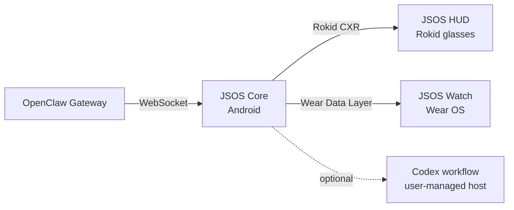

<p align="center">
  
</p>

<h1 align="center">JSOS</h1>

<p align="center">
  <strong>Your agents, beyond the screen.</strong><br>
  A voice-first spatial interface for OpenClaw and Codex across Android, Rokid glasses, and Wear OS.
</p>

<p align="center">
  <a href="https://github.com/IWhatsskill/JSOS/releases/tag/v2.0.34-conversation-ui"><strong>Download the preview</strong></a>
  &nbsp;&nbsp;&middot;&nbsp;&nbsp;
  <a href="docs/videos/JSOS-showcase.mp4"><strong>Watch the demo</strong></a>
  &nbsp;&nbsp;&middot;&nbsp;&nbsp;
  <a href="docs/INSTALL.md"><strong>Setup guide</strong></a>
  &nbsp;&nbsp;&middot;&nbsp;&nbsp;
  <a href="https://github.com/IWhatsskill/JSOS"><strong>Star on GitHub</strong></a>
</p>

<p align="center">
  
  
  
  
  
  
</p>

> [!IMPORTANT]
> JSOS is a development preview for builders and testers. Download it, try it
> with your own setup, and help shape what comes next.

JSOS puts the agents you already work with into the spaces where you work.
Talk to OpenClaw for conversation, context, and control. Use Codex when you
want to build, inspect, and iterate. JSOS carries that shared workflow across
phone, glasses, and watch so you can stay in the loop without staying at a
desk.

## One interface. Two agent worlds. Three surfaces.

| Agent | What it brings to JSOS |
| --- | --- |
| **OpenClaw** | Assistant conversations, sessions, voice, live context, and gateway control. |
| **Codex** | Coding workflows, iteration, review, and creation from the same spatial interface. |

Speak to an agent, listen to its response, switch context, and keep moving.
JSOS Core is the control room; the HUD and Watch bring the right piece of that
conversation into the moment.

<p align="center">
  
</p>

<p align="center"><sub>Original JSOS interface captures and demo HUD photography.</sub></p>

| Surface | Role |
| --- | --- |
| **JSOS Core** | The control room for sessions, models, voice, agent context, and device state. |
| **JSOS HUD** | A glanceable heads-up surface for prompts, responses, live status, and hands-free interaction. |
| **JSOS Watch** | Quick status, talk controls, and actions when reaching for the phone is too much. |

The Rokid HUD uses a deliberately restrained monochrome presentation for
visibility in the optical display. Phone and Watch use cyan for structure;
green remains reserved for active, ready, paired, and online states.

## Built for OpenClaw and Codex

OpenClaw remains the assistant and control plane: gateway, sessions, voice, and
live context. Codex brings the builder's loop into the same experience: ask,
inspect, change, and continue without losing the thread. JSOS turns both into a
coordinated phone, glasses, and wrist experience.

<p align="center">
  
</p>

<p align="center"><sub>OpenClaw assistant integration and JSOS system composition.</sub></p>

## Built for movement, not another mirrored chat window

- **Glanceable by design** - live state and agent output stay readable without
  turning the glasses into a dense phone screen.
- **Talkable end to end** - speak to your active agent and receive responses
  through the surface you are using, where that route is supported.
- **Session aware** - switch OpenClaw sessions, models, and coding context
  without losing the thread.
- **Local by default** - runtime credentials remain on the user's devices and
  managed hosts.
- **Three coordinated surfaces** - Core remains the source of truth while HUD
  and Watch expose the controls that matter in the moment.

## What you can do with it

- Start a voice conversation with OpenClaw while your phone, HUD, or Watch is
  the active surface.
- Continue a coding workflow with Codex without leaving the JSOS interface.
- Move from a full control-room view to a glanceable HUD or a quick wrist
  action without losing session context.
- Switch sessions and models, send prompts, receive responses, and keep the
  important state visible where you need it.
- Use the preview as a real project: download it, try it on your setup, report
  what you learn, and star the repository if it earns a place in your workflow.

## Quick start

1. Download JSOS Core, JSOS HUD, and the optional JSOS Watch APK from the
   [current preview release](https://github.com/IWhatsskill/JSOS/releases/tag/v2.0.34-conversation-ui).
2. Install JSOS Core on the Android phone and configure the OpenClaw Gateway.
3. Pair the Rokid glasses through Hi Rokid.
4. Deploy and launch JSOS HUD on the glasses.
5. Optionally install JSOS Watch on a paired Wear OS device.
6. Connect the optional user-managed Codex workflow when you want coding
   sessions in the same spatial interface.

For requirements, signing notes, and the complete connection flow, see
[docs/INSTALL.md](docs/INSTALL.md).

## Try it and shape it

JSOS is built for people who want their tools to move with them. If the preview
helps you talk, think, build, or debug in a new place, download it and give it
a real run. Found something useful? Open an issue, share what worked, and
[star the repository](https://github.com/IWhatsskill/JSOS) so other builders can
find it too.

## Architecture



JSOS Core owns credentials, sessions, models, and runtime state. HUD and Watch
receive only the state and actions required for their companion role.

## Documentation

| Guide | Purpose |
| --- | --- |
| [Install](docs/INSTALL.md) | Requirements, configuration, build, and connect flow |
| [Architecture](docs/ARCHITECTURE.md) | Components, protocols, and ownership |
| [HUD](docs/HUD.md) | Display model, controls, voice, camera, and R08 input |
| [Codex bridge](docs/CODEX-BRIDGE.md) | Connect user-managed Codex workflows to JSOS |
| [Screenshots](docs/SCREENSHOTS.md) | Public-safe visual gallery |
| [Security](docs/SECURITY.md) | Credentials, signing, logs, and release safety |
| [Troubleshooting](docs/TROUBLESHOOTING.md) | Pairing, connection, install, voice, and TTS |

## Build from source

Requirements: JDK 17, Android SDK, Android Studio or Gradle, Rokid CXR SDK
access, and a reachable OpenClaw Gateway. A user-managed Codex workflow is
optional.

```bash
./gradlew :phone-app:assembleDebug :glasses-app:assembleDebug :watch-app:assembleDebug
```

For secure build and release practices, see
[docs/SECURITY.md](docs/SECURITY.md).

## Preview status

JSOS is an active development preview. The experience can vary with Rokid
firmware, the proprietary CXR SDK, Hi Rokid, and the connected OpenClaw or
Codex workflow. Follow the setup guide and test with the devices and gateway
version you plan to use.
