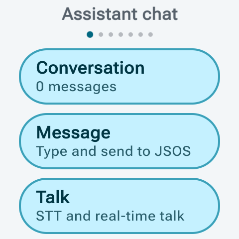
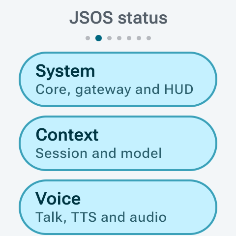
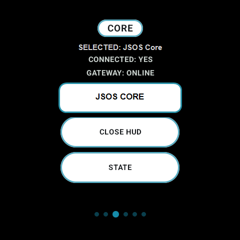
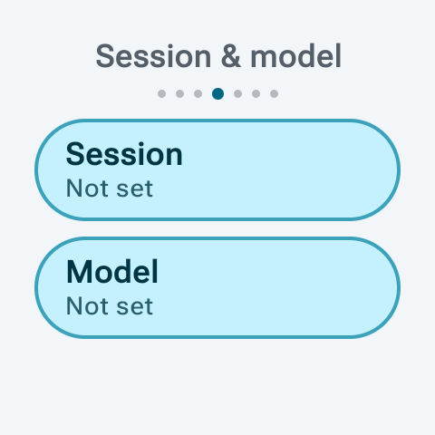
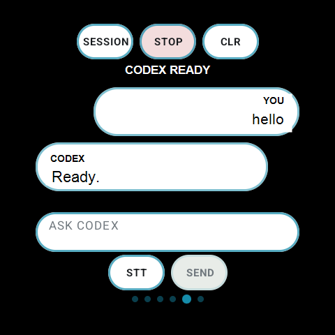
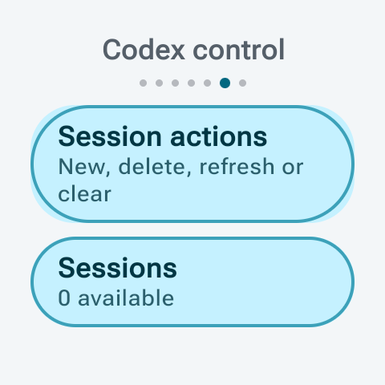
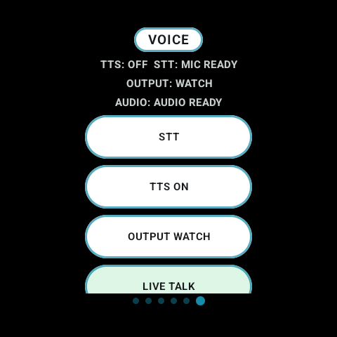

# Screenshots

This page shows public-safe JSOS screenshots and visual assets.

Before adding new screenshots, check that they do not expose private hosts, API keys, tokens, session keys, account data, serial numbers, MAC addresses, or device names.

## Main README Assets

  

  

  

## Additional Watch Screenshots

  
  
  
  
  
  
  

## Additional Core Screenshots

  
  
  
  
  

## Additional HUD Screenshots

  
  
  
  
  

  

